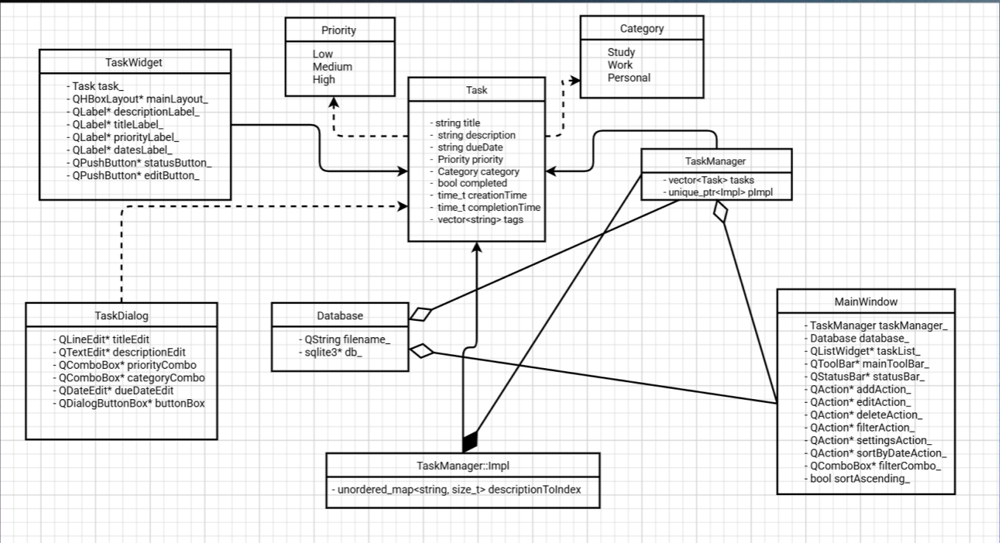

# Техническая документация

## Архитектура приложения

### Общая структура
Приложение построено по модульной архитектуре и состоит из следующих основных компонентов:

1. **Модуль пользовательского интерфейса (UI)**
   - Реализован с использованием Qt
   - Основные компоненты:
     - Главное окно (MainWindow)
     - Виджет списка задач (TaskWidget)
     - Диалог создания/редактирования задачи (TaskDialog)

2. **Модуль логики**
   - Класс TaskManager - основной класс для управления задачами
   - Класс Task - модель данных задачи

3. **Модуль работы с данными**
   - Класс Database - работа с SQLite



## Детальное описание компонентов

### 1. Модуль пользовательского интерфейса

#### MainWindow
- Основное окно приложения
- Содержит все основные виджеты
- Обрабатывает основные действия пользователя

#### TaskListWidget
- Отображает список задач
- Поддерживает сортировку и фильтрацию

#### TaskDialog
- Модальное окно для создания/редактирования задач
- Поддержка выбора даты через календарь
- Выбор приоритета и категории

#### DatabaseManager
- Синглтон для управления подключением к БД
- Реализует пул соединений
- Обрабатывает миграции БД


## База данны

### Схема БД
```sql
CREATE TABLE tasks ("
        "id INTEGER PRIMARY KEY AUTOINCREMENT, "
        "title TEXT NOT NULL, "
        "description TEXT NOT NULL, "
        "due_date TEXT, "
        "priority INTEGER NOT NULL, "
        "category INTEGER NOT NULL, "
        "completed INTEGER DEFAULT 0, "
        "creation_date INTEGER, "
        "completion_date INTEGER);

4. Генерация документации:
   ```bash
   cd build
   doxygen
   ```

## Расширение функциональности

### Планы по развитию
1. Добавление системы уведомлений
2. Интеграция с календарем
3. Синхронизация с облачными сервисами
4. Мобильная версия приложения
