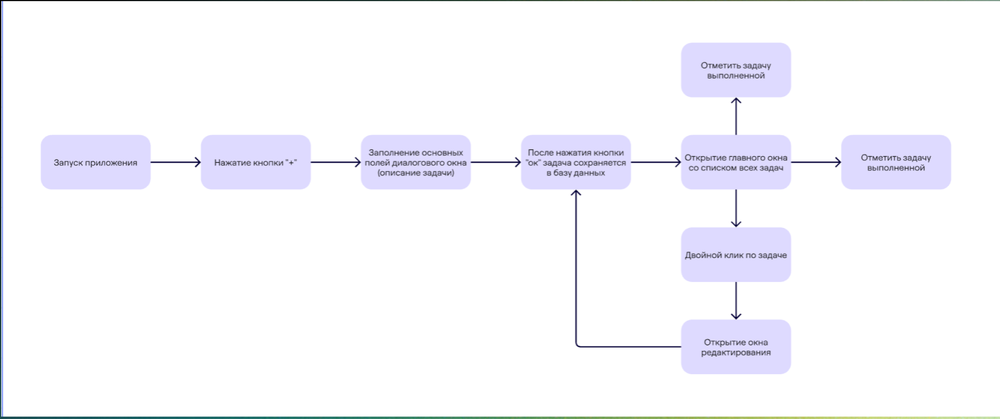

# Руководство пользователя

Менеджер задач - это приложение для эффективного управления вашими задачами и проектами. Оно поможет вам организовать работу, отслеживать прогресс и повысить продуктивность.

## Основные функции

### Главное окно

Главное окно разделено на несколько секций:
- Панель навигации (слева)
- Список задач (в центре)
- Календарь (справа)
- Панель статистики (внизу)

### Панель инструментов
- ![Добавить] - Создание новой задачи
- ![Редактировать] - Редактирование выбранной задачи
- ![Удалить] - Удаление задачи
- ![Фильтр] - Открытие панели фильтрации

## Работа с задачами

### Создание задачи
1. Нажмите кнопку "+"
2. Заполните обязательные поля:
   - Название задачи
   - Срок выполнения
   - Приоритет
   - Категория
3. Опционально заполните:
   - Описание
4. Нажмите "Ок"

### Редактирование задачи
1. Выберите задачу в списке
2. Нажмите значок "Редактировать" или дважды кликните по задаче
3. Внесите необходимые изменения
4. Сохраните изменения

### Удаление задачи
1. Выберите задачу в списке
2. Нажмите иконку "Удалить"
3. Подтвердите удаление

### Отметка о выполнении
- Кликните по чекбоксу рядом с задачей

## Категории и приоритеты

### Категории
Предустановленные категории:
- Работа
- Учеба
- Личное
- Другое

### Приоритеты
Уровни приоритета:
- 🔴 Высокий
- 🟡 Средний
- 🟢 Низкий

## Фильтрация и поиск

### Фильтры
Доступные фильтры:
- По статусу (все/в процессе/завершенные)

