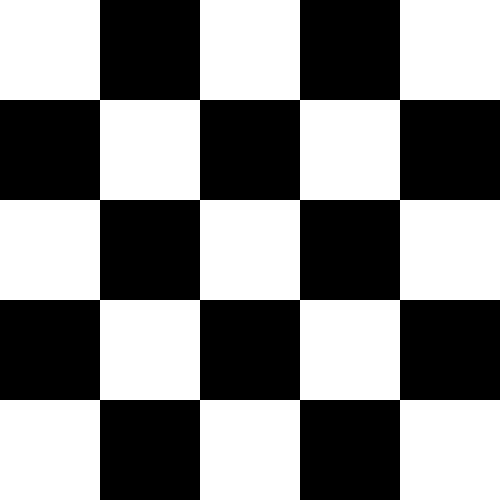
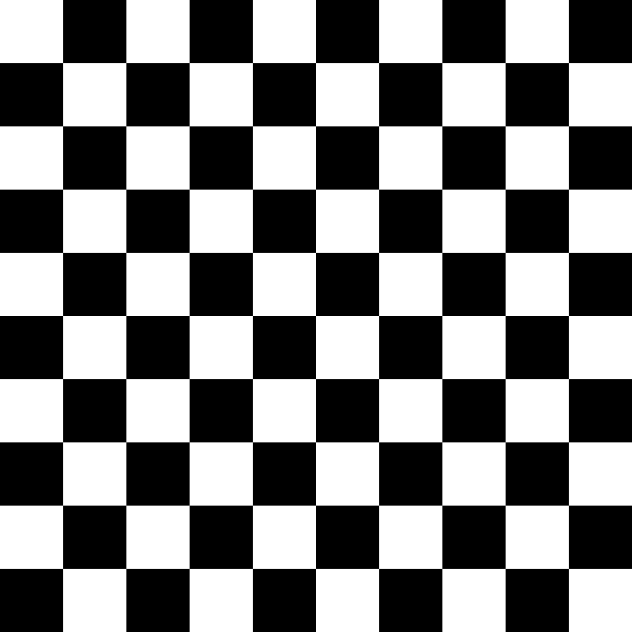
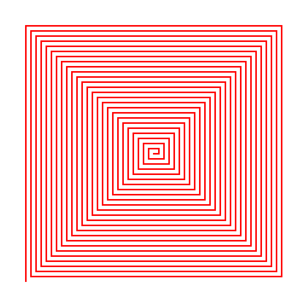
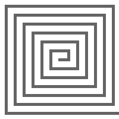
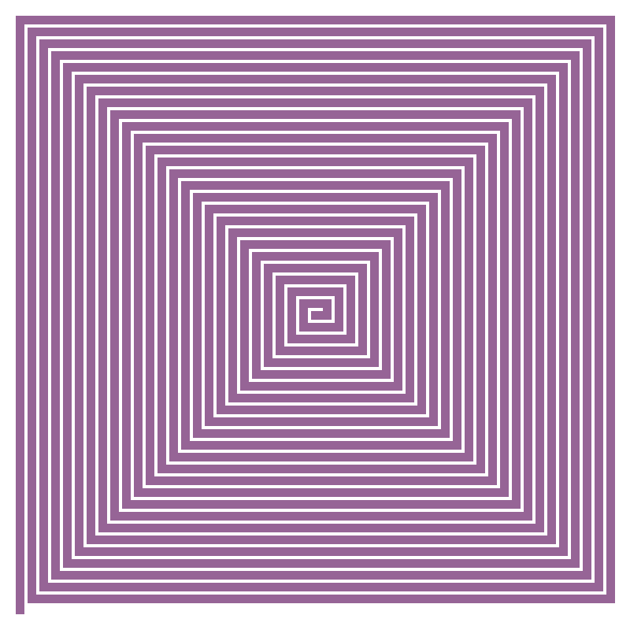

## 1 задача

```c++
#include <opencv2/opencv.hpp>
#include <iostream>
#include <string>
#include <vector>

//считываем аргументы из консоли(парсинг), по умолчанию задаем доску 8*8
void parseArguments(int argc, char** argv, int& rows, int& cols, int& cellSize) {
    rows = 8;
    cols = 8;
    cellSize = 50;
    
    for (int i = 1; i < argc; i++) {
        std::string arg = argv[i];
        if (arg == "--rows" && i + 1 < argc) {
            rows = std::stoi(argv[++i]); //преобразование строки в число
        } else if (arg == "--cols" && i + 1 < argc) {
            cols = std::stoi(argv[++i]);
        } else if (arg == "--cell" && i + 1 < argc) {
            cellSize = std::stoi(argv[++i]);
        }
    }
}

int main(int argc, char** argv) {
    int rows, cols, cellSize;
    parseArguments(argc, argv, rows, cols, cellSize);
    
    cv::Mat chessboard(rows * cellSize, cols * cellSize, CV_8UC3, cv::Scalar::all(255)); //создание матрицы нужного размера
    
    for (int i = 0; i < rows; i++) {
        for (int j = 0; j < cols; j++) {
            cv::Scalar color = (i + j) % 2 == 0 ? cv::Scalar(255, 255, 255) : cv::Scalar(0, 0, 0);// сумма индексов четная - белый цвет, сумма индексов нечетная - черный цвет
            cv::rectangle(chessboard, cv::Point(j * cellSize, i * cellSize), cv::Point((j + 1) * cellSize, (i + 1) * cellSize), color, cv::FILLED); //рисуем клетку нужного цвета
        }
    }
    
    cv::imwrite("chessboard.png", chessboard); //название картинки
    cv::imshow("Chessboard", chessboard); //имя, которое показывается при открытии
    cv::waitKey(0);
    
    return 0;
}
```

### Как запустить:

g++ main.cpp -o chessboard `pkg-config --cflags --libs opencv4`  ./chessboard --rows 12 --cols 12 --cell 50

### Пимеры:
--rows 12 --cols 12 --cell 50


--rows 5 --cols 5 --cell 100



--rows 10 --cols 10 --cell 90



## 2 задание

```c++
#include <opencv2/opencv.hpp>
#include <iostream>
#include <vector>

struct Config {
    int width = 600;
    int height = 600;
    int thick = 3;
    int step = 10;
    cv::Scalar color = cv::Scalar(255, 0, 0);
};

//считывание аргументов
void parseArguments(int argc, char** argv, Config& cfg) {
    for (int i = 1; i < argc; ++i) {
        std::string arg = argv[i];
        if (arg == "--width" && i + 1 < argc) cfg.width = std::stoi(argv[++i]);
        else if (arg == "--height" && i + 1 < argc) cfg.height = std::stoi(argv[++i]);
        else if (arg == "--thick" && i + 1 < argc) cfg.thickness = std::stoi(argv[++i]);
        else if (arg == "--step" && i + 1 < argc) cfg.step = std::stoi(argv[++i]);
        else if (arg == "--color" && i + 1 < argc) {
            std::string colorStr = argv[++i];
            size_t c1 = colorStr.find(','), c2 = colorStr.rfind(',');
            cfg.color = cv::Scalar(
                std::stoi(colorStr.substr(0, c1)),
                std::stoi(colorStr.substr(c1+1, c2-c1-1)),
                std::stoi(colorStr.substr(c2+1))
            );
        }
    }
}

//рисуем спираль
void drawAngledSpiral(cv::Mat& img, const Config& cfg) {
    cv::Point center(cfg.width/2, cfg.height/2);//центр изображения
    std::vector<cv::Point> points;//вектор для хранения точек спирали
    
    int segments = 4; //4 направления: вправо, вверх, влево, вниз
    int segment_length = cfg.step; //начальная длина отрезка
    int direction = 0; // 0=вправо, 1=вверх, 2=влево, 3=вниз
    
    points.push_back(center); //начинаем с центра
    
    for (int i = 1; i < 100; ++i) {
        cv::Point last = points.back(); //крайняя точка
        cv::Point next = last;//новая точка
        
        switch (direction % 4) { //выбор направления 
            case 0: next.x += segment_length; break; // вправо
            case 1: next.y -= segment_length; break; // вверх
            case 2: next.x -= segment_length; break; // влево
            case 3: next.y += segment_length; break; // вниз
        }
        
        points.push_back(next); //добавляем новую точку
        
        //увеличиваем длину отрезка после каждых двух поворотов
        if (i % 2 == 0) segment_length += cfg.step;
        
        direction++;
    }
    
    //рисуем ломаную линию
    for (size_t i = 1; i < points.size(); ++i) {
        cv::line(img, points[i-1], points[i], cfg.color, cfg.thick);
    }
}

int main(int argc, char** argv) {
    Config cfg;
    parseArguments(argc, argv, cfg);
    
    cv::Mat image(cfg.height, cfg.width, CV_8UC3, cv::Scalar(255, 255, 255));
    drawAngledSpiral(image, cfg);
    
    cv::imwrite("spiral.png", image);
    cv::imshow("Spiral", image);
    cv::waitKey(0);
    
    return 0;
}
```

### Как запустить:

g++ main2.cpp -o spiral  `pkg-config --cflags --libs opencv4`

./spiral --width 600 --height 600 --thick 3 --step 10 --color 255,0,0

--width 600 --height 600 --thick 3 --step 10 --color 255,0,0



--width 200 --height 200 --thick 1 --step 15 --color 200,200,200



--width 800 --height 800 --thick 5 --step 10 --color 100,100,100

