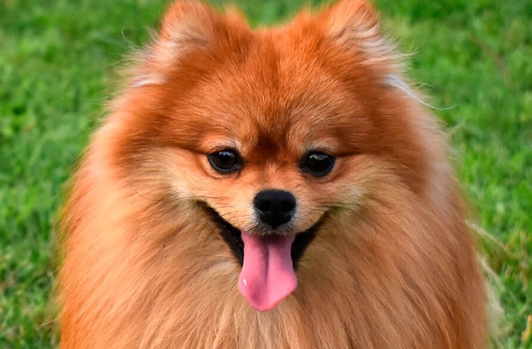
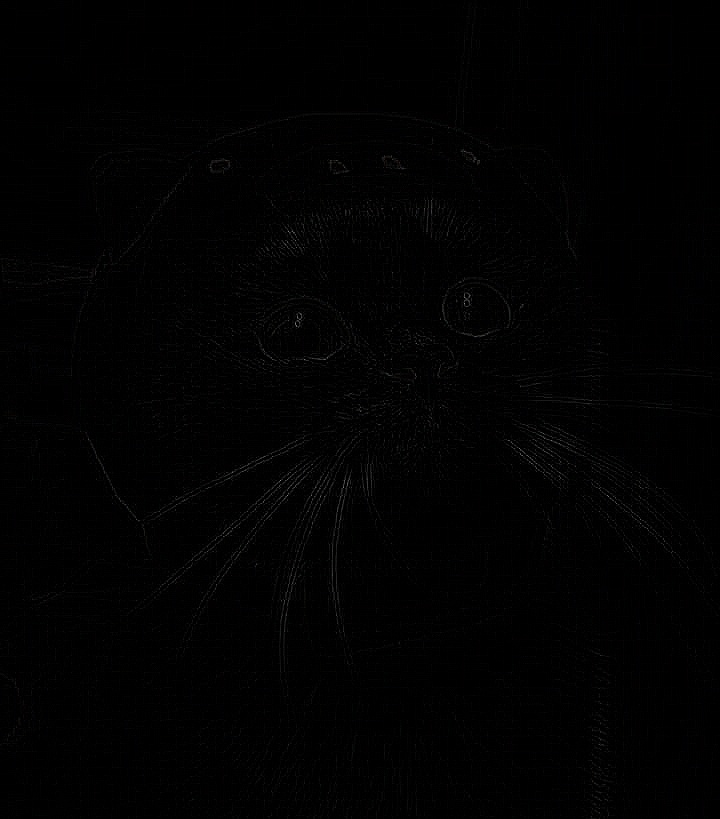
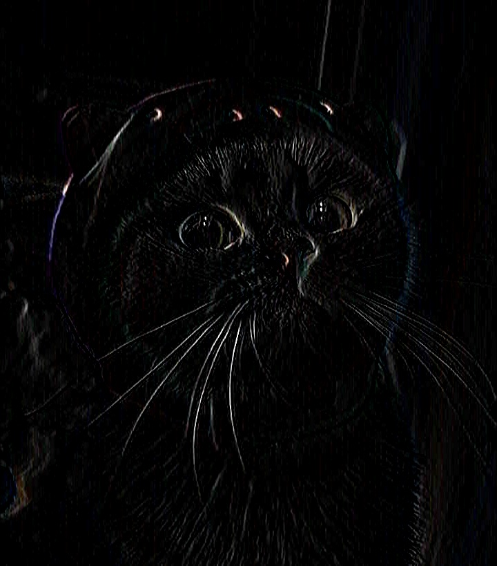

## 1 задание

```c++
#include <opencv2/opencv.hpp>
#include <iostream>
#include <vector>

using namespace cv;
using namespace std;

void applyBlur(const Mat& input, Mat& output, int kernelSize) {
    if (kernelSize % 2 == 0) {
        cerr << "Kernel size must be odd" << endl;
        return;
    }
    int border = kernelSize / 2; //размер границ вокруг изображение
    output = Mat::zeros(input.size(), input.type());
    Mat padded;
    copyMakeBorder(input, padded, border, border, border, border, BORDER_REPLICATE); //добавление границ к изображению для обработки краев
    for (int y = 0; y < input.rows; y++) {
        for (int x = 0; x < input.cols; x++) {
            for (int c = 0; c < input.channels(); c++) {
                float sum = 0.0;
                //применение ядра
                for (int ky = -border; ky <= border; ky++) {
                    for (int kx = -border; kx <= border; kx++) {
                        sum += padded.at<Vec3b>(y + border + ky, x + border + kx)[c];
                    }
                }
                output.at<Vec3b>(y, x)[c] = saturate_cast<uchar>(sum / (kernelSize * kernelSize)); //усреднение
            }
        }
    }
}

int main(int argc, char** argv) {
    String inputPath, outputPath;
    int kernelSize = 3;
    
    //парсинг
    for (int i = 1; i < argc; i++) {
        if (string(argv[i]) == "--input") {
            inputPath = argv[++i];
        } else if (string(argv[i]) == "--output") {
            outputPath = argv[++i];
        } else if (string(argv[i]) == "--kernel") {
            kernelSize = atoi(argv[++i]);
        }
    }
    
    //проверка наличия обязательных аргументов
    if (inputPath.empty() || outputPath.empty()) {
        cout << "Usage: ./lab2 --input input.jpg --output blur.jpg --kernel 3" << endl;
        return -1;
    }
    Mat image = imread(inputPath);
    if (image.empty()) {
        cerr << "Could not open or find the image" << endl;
        return -1;
    }
    Mat blurredImage;
    applyBlur(image, blurredImage, kernelSize);//применение размытия
    imwrite(outputPath, blurredImage);

    return 0;
}
```

## Как запустить:
g++ main1.cpp -o main1 `pkg-config --cflags --libs opencv4`

## Исходное изображение 1


./main1 --input input1.jpg --output blur1.jpg --kernel 17


## Исходное изображение 2



./main1 --input input2.jpg --output blur2.jpg --kernel 15


./main1 --input input2.jpg --output blur3.jpg --kernel 3


## 2 задание

```c++
#include <opencv2/opencv.hpp>
#include <iostream>
#include <fstream>
#include <vector>

std::vector<std::vector<float>> readKernelFromFile(const std::string& filename) {
    std::ifstream file(filename);
    std::vector<std::vector<float>> kernel;
    
    if (!file.is_open()) {
        std::cerr << "Could not open kernel file: " << filename << std::endl;
        return kernel;
    }

    int size;
    file >> size; //чтение первой строки из файла

    kernel.resize(size, std::vector<float>(size));
    for (int i = 0; i < size; i++) {
        for (int j = 0; j < size; j++) {
            file >> kernel[i][j]; //чтение значения ядра
        }
    }

    file.close();
    return kernel;
}

void applyCustomKernel(const cv::Mat& input, cv::Mat& output, const std::vector<std::vector<float>>& kernel) {
    int kernelSize = kernel.size();
    int border = kernelSize / 2;
    
    output = cv::Mat::zeros(input.size(), input.type());

    cv::Mat padded;
    cv::copyMakeBorder(input, padded, border, border, border, border, cv::BORDER_REPLICATE); //добавление границ

    for (int y = 0; y < input.rows; y++) {
        for (int x = 0; x < input.cols; x++) {
            for (int c = 0; c < input.channels(); c++) {
                float sum = 0.0f;
                //применение ядра
                for (int ky = -border; ky <= border; ky++) {
                    for (int kx = -border; kx <= border; kx++) {
                        float kernelValue = kernel[ky + border][kx + border];
                        sum += padded.at<cv::Vec3b>(y + border + ky, x + border + kx)[c] * kernelValue;
                    }
                }
                
                output.at<cv::Vec3b>(y, x)[c] = cv::saturate_cast<uchar>(sum);
            }
        }
    }
}

int main(int argc, char** argv) {
    std::string inputPath, outputPath, kernelPath;
    //парсинг
    for (int i = 1; i < argc; i++) {
        if (std::string(argv[i]) == "--input") {
            inputPath = argv[++i];
        } else if (std::string(argv[i]) == "--output") {
            outputPath = argv[++i];
        } else if (std::string(argv[i]) == "--kernel_file") {
            kernelPath = argv[++i];
        }
    }
    
    if (inputPath.empty() || outputPath.empty() || kernelPath.empty()) {
        std::cout << "Usage: ./lab2 --input input.jpg --output result.jpg --kernel_file kernel.txt" << std::endl;
        return -1;
    }

    cv::Mat image = cv::imread(inputPath);
    if (image.empty()) {
        std::cerr << "Could not open or find the image" << std::endl;
        return -1;
    }

    std::vector<std::vector<float>> kernel = readKernelFromFile(kernelPath);
    if (kernel.empty()) {
        std::cerr << "Failed to read kernel or kernel is empty" << std::endl;
        return -1;
    }


    if (kernel.size() % 2 == 0) {
        std::cerr << "Kernel size must be odd" << std::endl;
        return -1;
    }

    cv::Mat result;
    applyCustomKernel(image, result, kernel);

    if (!cv::imwrite(outputPath, result)) {
        std::cerr << "Failed to write output image" << std::endl;
        return -1;
    }

    return 0;
}
```

## Как запустить:

g++ main2.cpp -o main2 `pkg-config --cflags --libs opencv4`

## Исходное изображение такое же, как и первое

./main2 --input input1.jpg --output sharpen1.jpg --kernel_file kernel.txt


./main2 --input input1.jpg --output laplacian.jpg --kernel_file kernel1.txt



./main2 --input input1.jpg --output sobel.jpg --kernel_file kernel2.txt

